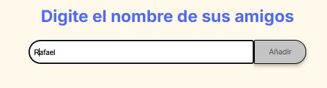
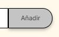
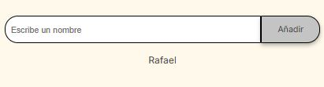
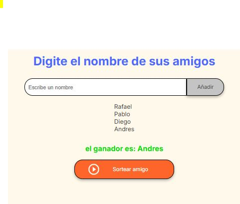
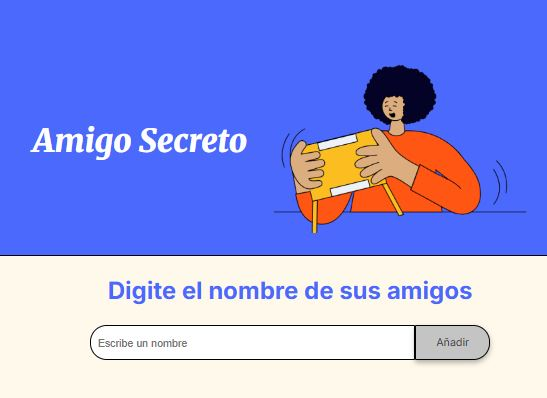
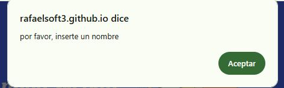
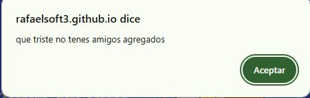

# challenge amigo secreto
El principal objetivo de este desafío es fortalecer tus habilidades en lógica de programación. Aquí deberás desarrollar la lógica para resolver el problema.

>[!tip]
>Esta aplicación ofrece diversas utilidades. Por ejemplo, en una reunión de amigos donde surge la duda sobre quién debe ir a comprar las bebidas, la app facilita la elección de manera justa y evita discusiones innecesarias.

<h1>¿COMO FUNCIONA LA APP AMIGO SECRETO?</H1>

Primero escribe el nombre de tu amigo que deceas agregar. Ejemplo: Rafael.

Preciona el boton "añadir" para que se pueda guardar ese nombre.                      

Luego veremos que se guardo con exito, cuando muestra el nombre de tu amigo.       

Cuando allas agregado una, dos, tres o mas amigos .Presiona el boton de sortear amigo.                                                                             

Nos mostrara el amigo que salio sorteado .en este caso Andres.
                                          

>[!warning]
>Esta aplicacion detecta si dejaste el campo vacio de amigo. Es decir te da un alerte si no pusite nada al apretar el boton de añdir para que no suba campos vacios.

>[!warning]
>Esta aplicacion te advierte si no agregaste amigos para hacer el sorteo precionando el boton "sortear amigo"                                                    

