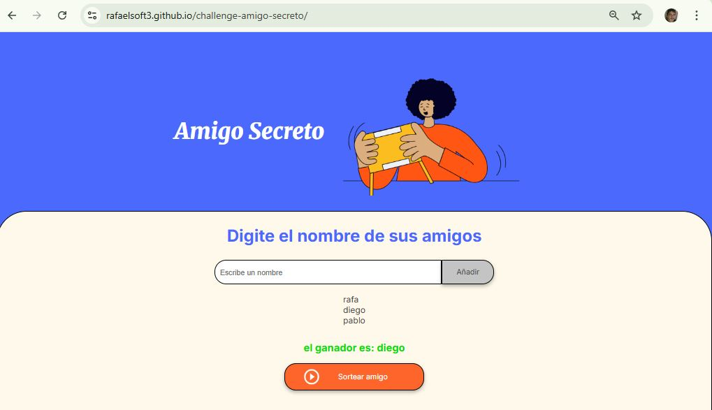

# challenge amigo secreto
El principal objetivo de este desafío es fortalecer tus habilidades en lógica de programación. Aquí deberás desarrollar la lógica para resolver el problema.

[!tip]esta app tiene muchas utilidades por ejemplo: una reunion de amigos, y no se ponen de acuerdo quien ira a comprar las vebidas, usando esta app no abra discuciones quien le toque ir.
